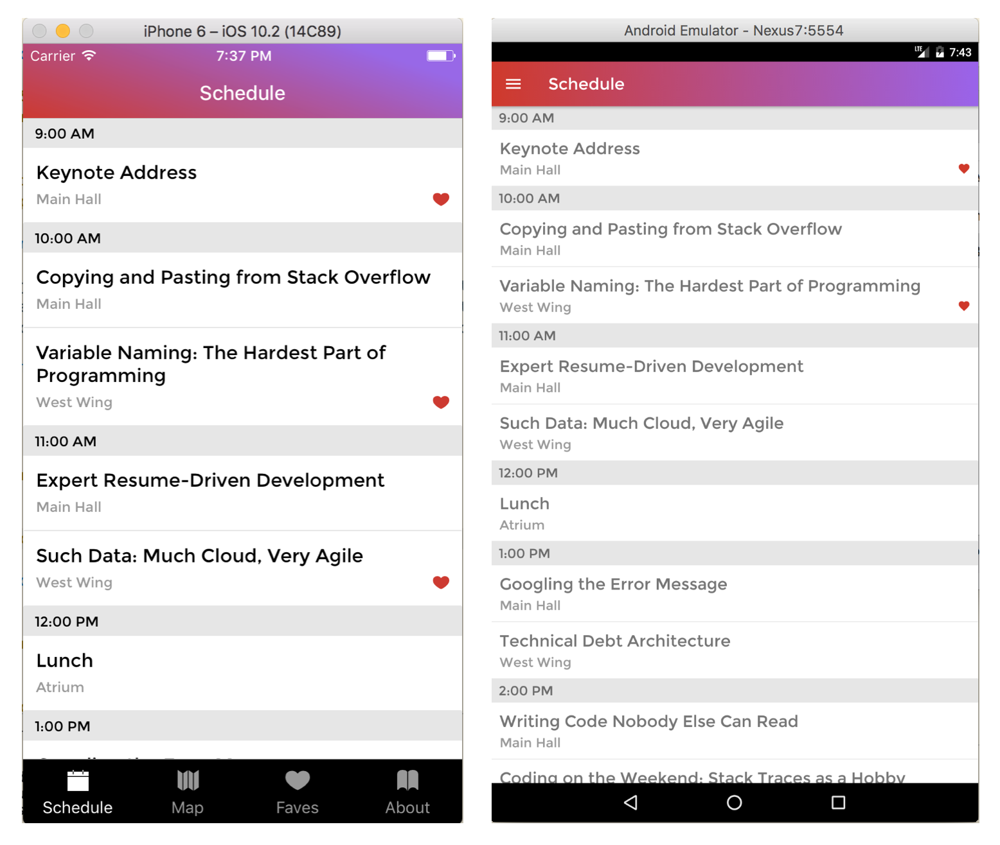

# R10

The purpose of this project was to create, using react-native, mobile apps for the iOS and Android platforms.  The app built modelled
 an event scheduling app for a fictitious tech conference.

## Technologies Used

 - React & React Native
 - JavaScript
 - Redux
 - Realm
 - Ex-navigator
 - Development tools (Git, babel, es-lint, npm / yarn)

## Personal Learnings

 This project gave me experience in building mobile apps for the iOS and Android platforms using JavaScript with React-Native.  The app used a series of
  react-native components to construct the various scenes of the app.  Database connections were being made via REST end-points for remote database operations 
  and a local-device Realm database for local operations.  Redux was integrated into the react-native architecture for state management.

## Installation

#### iOS

- Install XCode
- Clone or download project
- Run `npm i` or `yarn` to install
- Start a react natve packager
- Run `react-native run-ios`

#### Android

- Install Android Studio and configure an emulator
- Run android avd and start emulator
- Clone or download project
- Run `npm i` or `yarn` to install
- Start a react natve packager
- Run `react-native run-android`
